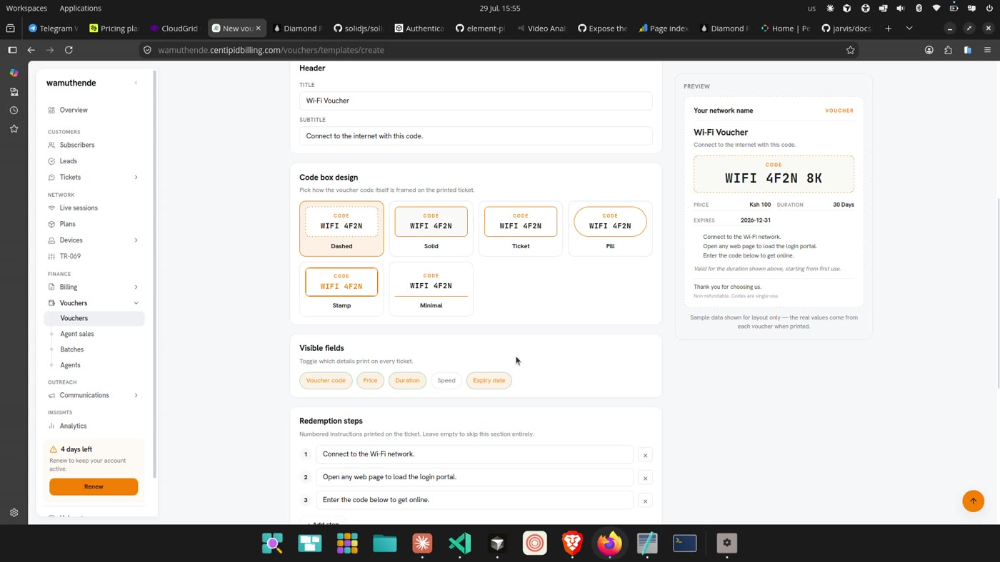
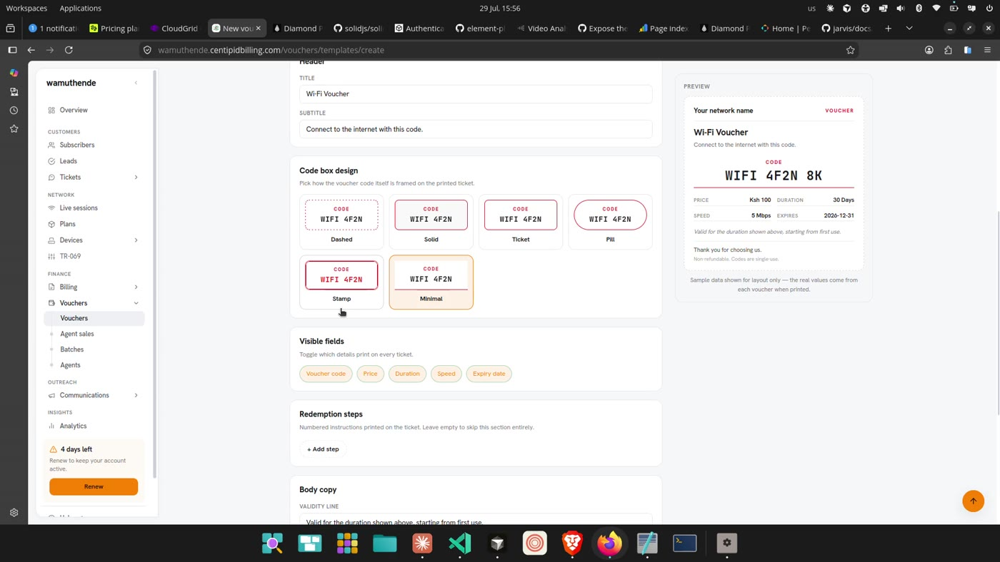
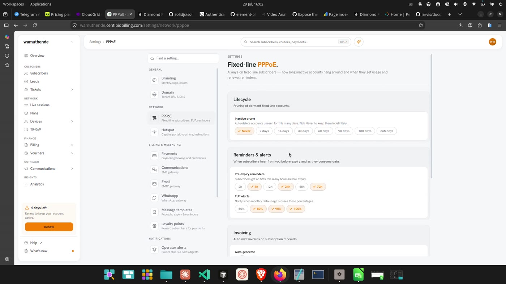
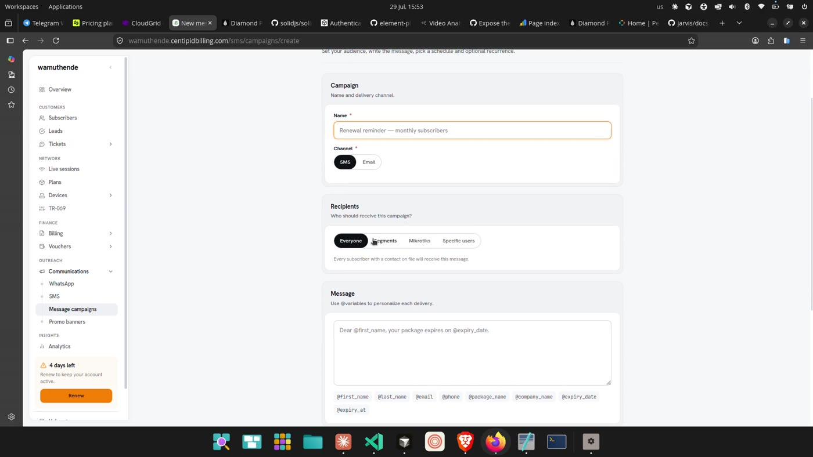
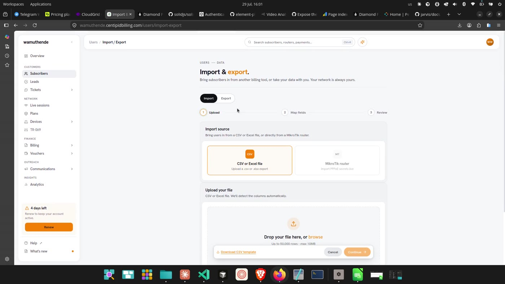
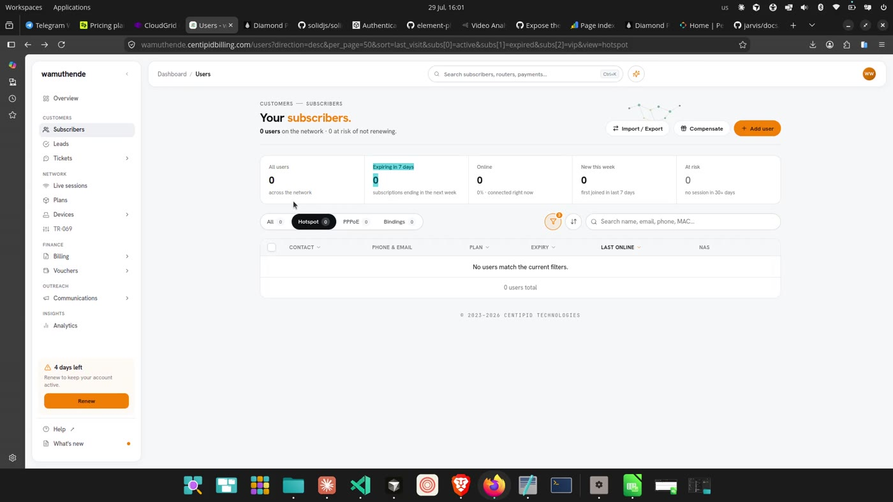
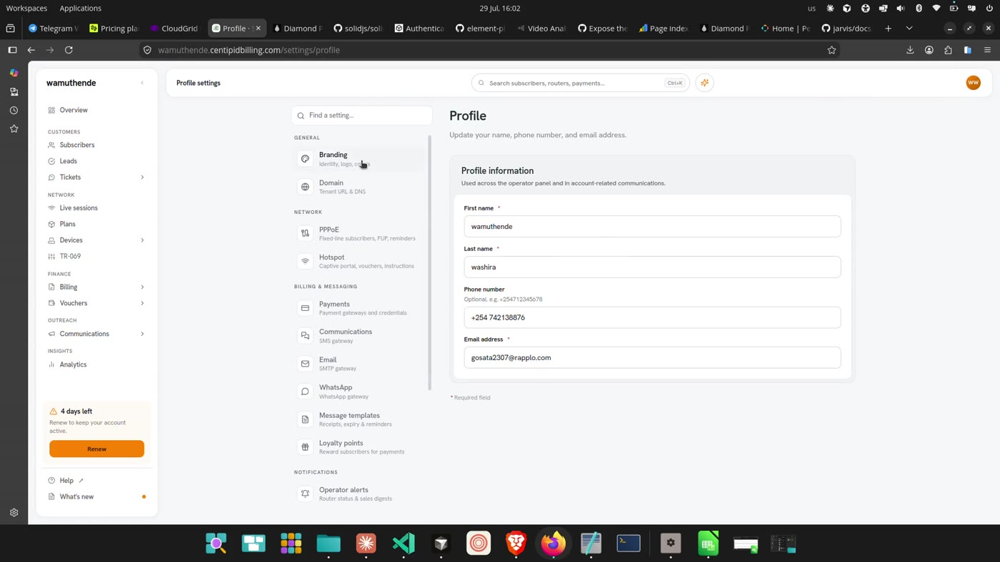
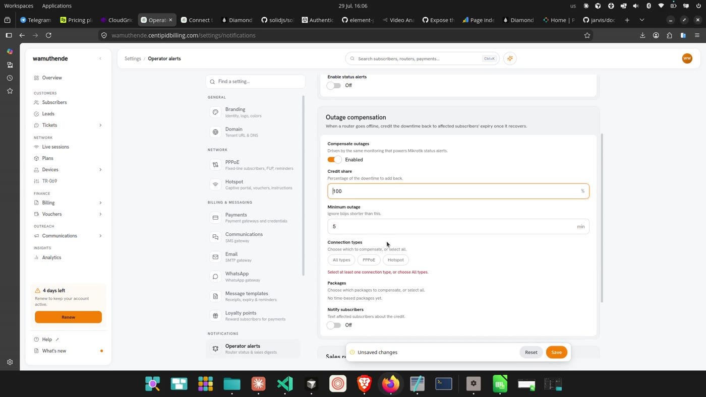
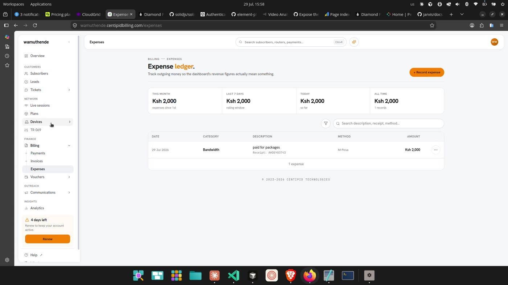

# What to borrow from Centipid Billing

Notes from a 14m43s screen recording of an ISP billing panel
(`wamuthende.centipidbilling.com`). Frames in [`centipid/`](centipid/).

This is the video that matters. The one before it showed a portal designer; this
one shows the pattern properly, applied to a **printed artefact**, plus a dozen
smaller things worth taking.

> **What I could not judge.** Frames, not motion — I can see a preview
> re-rendered, not how it animated. No audio.

---

## 1. The template designer — this is the "redesign a page at will" screen

**New voucher template.** *"Tweak the copy, branding, and fields. The preview on
the right updates as you type."*

Form on the left, the actual voucher on the right, redrawn on every keystroke.
Top-right: **Cancel · Preview PDF · Create template**.

Sections:

| Section | What it holds |
| --- | --- |
| Template | The design's own name |
| Branding | Company name, logo URL, accent colour, **Colour / B&W** mode |
| Header | Title, subtitle |
| Code box design | Six framings, drawn as miniatures |
| Visible fields | Which details print, as toggle chips |
| Redemption steps | Numbered rows, removable, `+ Add step` |
| Body copy | The validity line |
| Footer | Support phone, support email, footer text |

Under the preview:

> *Sample data shown for layout only — the real values come from each voucher
> when printed.*

**Why this is the right shape.** The thing being designed is not a screen, it is
a **document that leaves the system** — printed, handed to a customer, kept in a
wallet. That is precisely where a live preview earns its cost, because there is
no other way to see it before a hundred are printed wrong. A settings form for
"how the panel looks" has the panel itself as its preview; a voucher has nothing.

### The six code-box styles, drawn as themselves

Dashed · Solid · Ticket · Pill · Stamp · Minimal — each rendered as a small
version of the real thing with the real code in it. Not swatches, not names in a
select. You pick the one that looks right because you can see it.

**The rule to steal:** *when a choice changes appearance, the option must show
the appearance.* We have this nowhere — every visual choice in PanelKit is a
label in a segmented control.

### For us

We already have `Invoice.vue` — a document that leaves the system, currently
hardcoded. The same treatment applies to an invoice, a receipt, and a voucher:

- a `DocumentTemplate` a tenant owns,
- a designer screen with the artefact previewed live,
- **Preview PDF** as the honest test, because a browser preview is not a printer,
- sample data in the preview with that caption stating it is sample data.

This is the item worth building first. It is the one thing in either video that
PanelKit has no equivalent of at all.

---

## 2. Duration as chips, not a number box

*Fixed-line PPPoE → Lifecycle → Inactive prune:* `7 days · 14 · 30 · 60 · 90 ·
180 · 365`, one selected. Pre-expiry reminders: `2h · 6h · 12h · 24h · 48h ·
72h`. FUP alerts: `50% · 80% · 90% · 100%`.

Nobody types 47 days. Offering a number input pretends every value is equally
sensible, makes the operator invent one, and then needs validation to reject the
ones that are not. A row of chips is the decision as it actually exists.

**For us.** The trash retention (7–30 days) is a number input with a min and a
max — the exact case this fixes. Worth a `->presets([7, 14, 30])` on the number
field, falling back to the input when the answer really is arbitrary.

---

## 3. Message templates carry their variables underneath

Every message body has its available placeholders as **chips directly below the
textarea** — `@first_name`, `@package_name`, `@expiry_date`, `@amount`,
`@code` — and each template has its own on/off toggle beside its label.

No documentation to open, no "see the docs for available variables". The
vocabulary is where the writing happens.

**For us.** Scheduled reports and announcements both compose text; neither offers
this. It is a small component — a list of tokens that insert at the cursor.

---

## 4. A scope you cannot export tells you before you press Continue

Export → *What to export*: every scope carries **its current count** — All users
`0`, PPPoE users `0`, Hotspot users `0`, Bindings `0`. Select an empty one and:

> **No subscribers in scope** — This scope has no subscribers to export. Choose a
> different scope to continue.

...with **Continue disabled**.

Three good decisions in one control: the count is shown *before* the choice, the
empty case is explained where it happened, and the action that would produce an
empty file is prevented rather than allowed and then apologised for.

**For us.** Our export runs from the current filter and finds out afterwards.

---

## 5. The first-run checklist that names the next step

*"Set up your account — 3 of 6 done · 3 steps left"*, a progress bar, then:

- a single highlighted **NEXT STEP** row — *Create your first plan →*
- **ALREADY DONE:** ✓ Set network name & logo ✓ Choose payment gateway ✓
  Configure SMS provider

One next action, not six competing ones. The completed items stay visible as
evidence of progress rather than disappearing.

The dashboard also greets by time of day and states the network's condition in a
sentence — *"SMS credit low — a few things need a minute"* / *"The day is in full
swing"* — and has a **What's next?** panel that is advice, not statistics: *"SMS
credit low — Top up before reminders start failing."*

**For us.** `InstallationState` already knows what is and is not configured, and
`panel:doctor` already computes what is silently wrong. Neither reaches the
dashboard. This is mostly wiring.

---

## 6. Settings is a searchable index, not a tab strip

A left column of settings groups — GENERAL, NETWORK, BILLING & MESSAGING,
NOTIFICATIONS — each entry a **title plus one line saying what is in it**
("Payments · Payment gateways and reconciliation"), above a **"Find a setting"**
search box.

Once there are more than about six settings screens, a person does not know
which one holds the thing they want. The description line is what makes the list
scannable; the search is what makes it work at twenty.

**For us.** Ours is Profile · Security · Organisation, bare. It is small enough
today and will not stay that way.

---

## 7. Conditional sections, not just conditional fields

*Operator alerts → Outage compensation.* Off, it is one toggle. On, it reveals
credit share, minimum outage, connection types, packages, and a *Notify
subscribers* toggle — which itself reveals a message template with its own
variable chips.

Loyalty points does the same at a coarser grain: **disabled, the earning and
redemption sections do not exist on the page at all** — not greyed, absent.

And the validation speaks in consequences: *"Select at least one connection type,
or choose All types"*, *"Price must be at least 1 — a paid package cannot cost
0."* The second half of that sentence is the part worth copying.

**For us.** `visibleWhen` works per field. A whole `Section` cannot yet depend on
a value, so the alternative today is a disabled block that still occupies the
page.

---

## 8. Wizards with the steps in the header

*Link a MikroTik*: `Identity → Provision → Services → Done`, current step
highlighted, in the panel header. Import is the same: `Upload → Map fields →
Review`. Export: `Scope → Format → Columns`.

We have a wizard field; we do not have this at page level, and the multi-step
things we do have (import, restore) do not show where you are.

---

## 9. Small things worth copying wholesale

- **Every list page follows one template**: a title whose second word is coloured
  ("Expense **ledger**.", "Hardware **inventory**."), a one-line purpose, a stats
  strip, filter tabs with counts, search, and an empty state that **names the
  button to press** — *"No campaigns yet. Use 'New campaign' to schedule your
  first banner."*
- **Empty states with a tone**: *"Nothing's happened yet today — quiet network,
  healthy operator."* An empty dashboard is usually good news and rarely says so.
- **Conditional field inside a form**: choosing M-Pesa as the payment method
  reveals a Receipt number field. Cash does not.
- **A trial banner pinned to the sidebar footer** — *"4 days left · Renew to keep
  your account active"* — above Help, out of the content area.
- **Phone-number chips** with *"Press Enter to add. Empty = notify all admins."*
  The empty case is defined rather than left to guessing.

## 10. What I would not copy

- **Colour is `<input type="color">`**, so the picker is the operating system's
  dialog — it looks like a different application, and on Linux it is a GTK
  palette grid. Fine as a fallback beside a text field; not as the only way in.
- **The nav is nine groups deep** in a panel with five real subjects. We have
  just finished cutting ours down.

---

## Order I would build these

1. **Document template designer** — voucher/invoice/receipt, live preview, PDF.
   The real gap, and the thing this video is actually about.
2. **Visual option pickers** — options that render as what they do. Needed by 1,
   useful everywhere after.
3. **Numeric presets as chips** — small, and it fixes trash retention today.
4. **Dashboard setup checklist** — mostly wiring `InstallationState`.
5. **Conditional sections** — a schema change; do it when 1 needs it.
6. **Variable chips under message fields** — small component, three callers.
7. **Settings index with descriptions and search** — when settings outgrow three.
