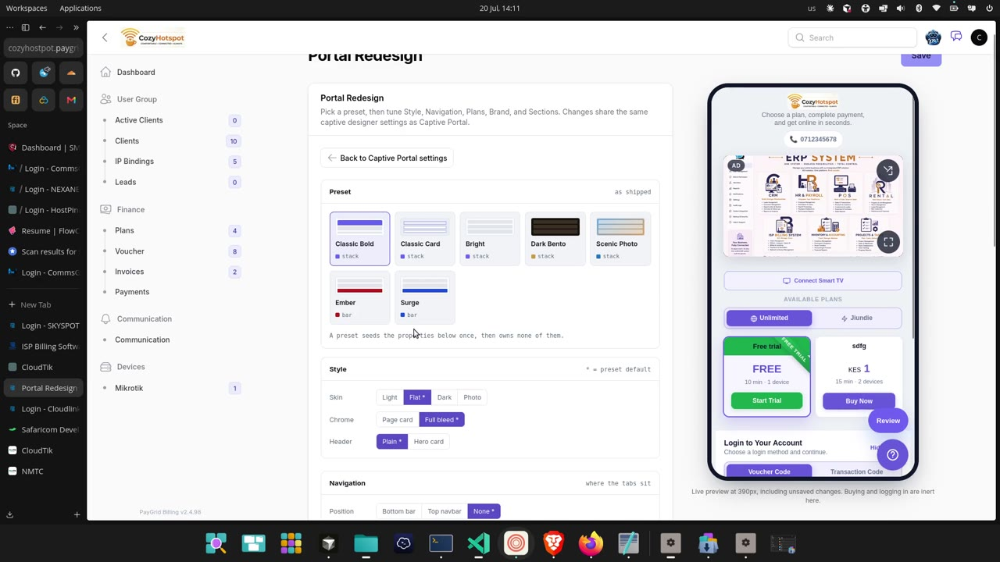
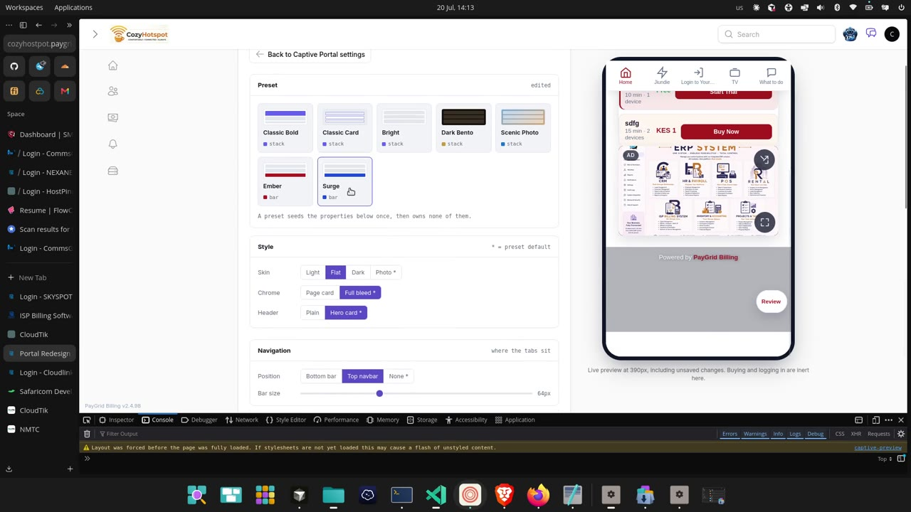
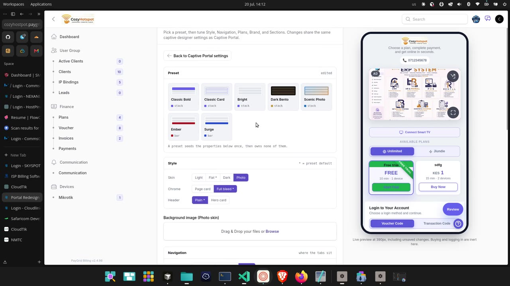
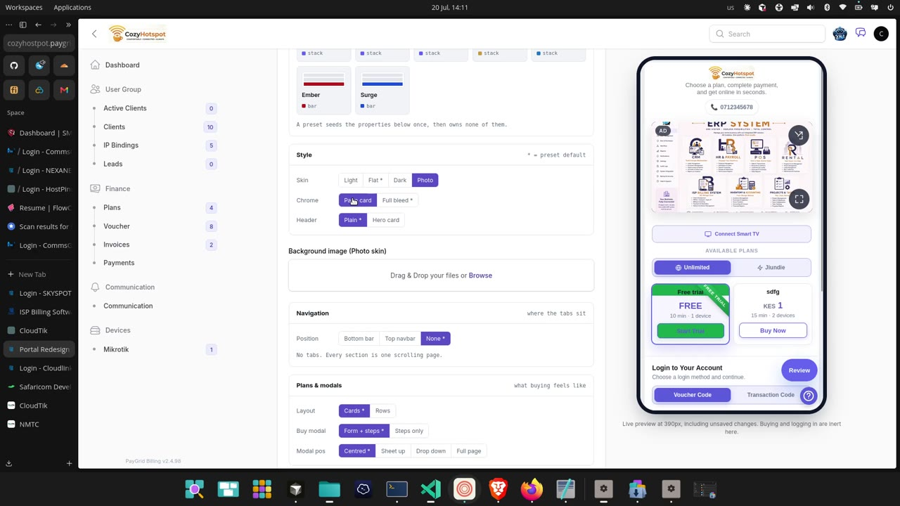
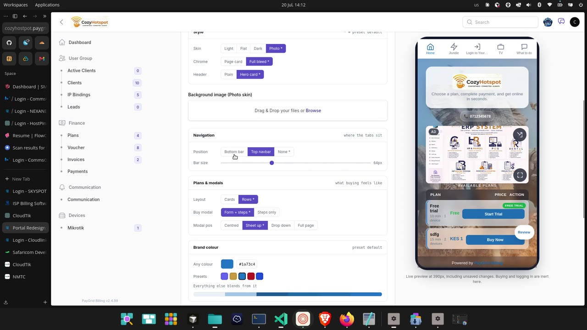
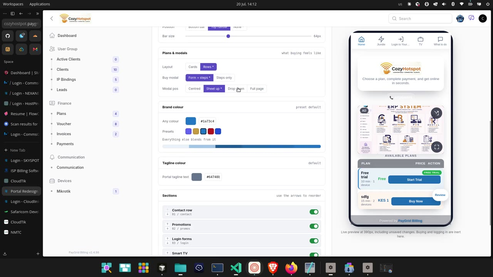
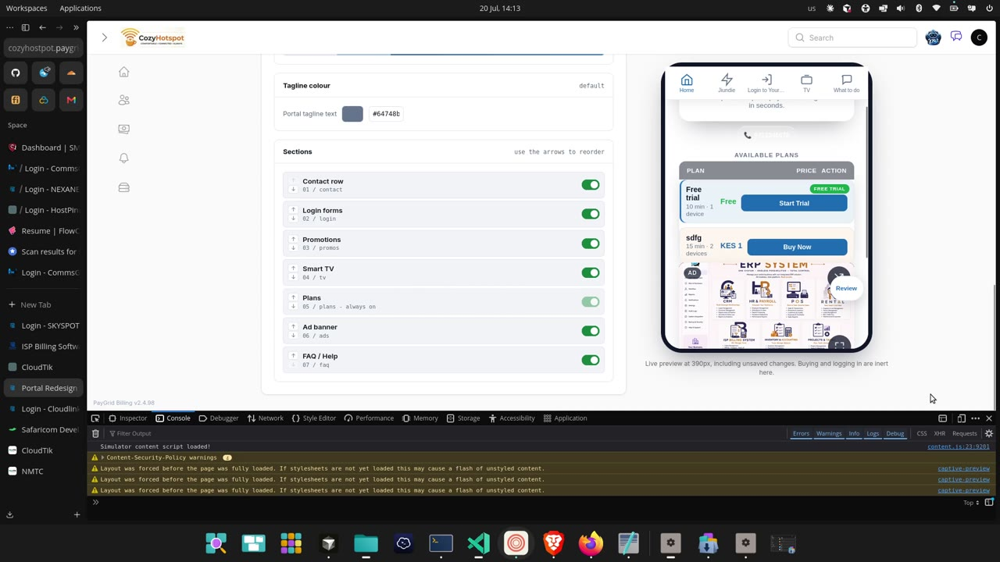

# What to borrow from the PayGrid portal designer

Notes from a 2m50s screen recording of *PayGrid Billing v2.4.98* — a hotspot
billing panel — spent almost entirely inside one screen: **Portal Redesign**, a
live designer for the captive portal its tenants show their customers.

Frames are in [`portal-designer/`](portal-designer/). Everything below is an idea
worth stealing, what it costs us, and where it lands in PanelKit.

> **What I could not judge.** Frames, not motion — I can see that a preview
> re-rendered but not how it animated. No audio, so if the recording was narrated
> the reasoning behind any of this is lost and what follows is inference from the
> screen.

---

## The one-line summary

It is a **settings form with a phone strapped to the side of it**, and almost
every good decision on the screen follows from taking that arrangement seriously.

We already have the two halves separately — a settings screen, and a device
preview at `/screens/devices`. We have never put them on the same screen.

---

## 1. The live preview is the other half of the form



A 390px phone sits to the right of the form and re-renders on every change. Under
it, one line of small grey text:

> *Live preview at 390px, including unsaved changes. Buying and logging in are
> inert here.*

That sentence is the best piece of writing in the whole interface. It states the
**width**, that it shows **unsaved** state, and — crucially — **what is fake**.
Without the last clause somebody eventually clicks *Buy Now* in a preview and
files a bug about a payment that never arrived.

**For us.** `PkDeviceFrame` already exists and now does laptops too. What is
missing is a settings screen that mounts it beside the form. The obvious first
home is tenant branding: an operator picking a brand colour should see their own
panel repaint, not a swatch.

**Cost:** small. The frame is built, the iframe trick is built, and the tenant
theme is already applied at runtime by `useTenantTheme`.

---

## 2. A preset seeds; it does not own

> *A preset seeds the properties below once, then owns none of them.*

Seven presets, each a small wireframe thumbnail plus a colour dot plus a tag
(`stack` / `bar`) that encodes the **navigation shape**, not just the palette.
Picking one writes values into the form and then lets go.

This avoids the trap every theme picker falls into: presets that stay bound, so
changing one property either silently detaches you from the preset or gets
overwritten next time the preset is touched.

**For us.** Directly applicable to the role templates we already ship
(`RoleTemplates`), and to any future panel/branding preset. Our role templates
already behave this way; they just do not *say* so on screen.

---

## 3. `*` marks the preset's default, and it moves



Every segmented control marks one option with `*`, and the section header says
`* = preset default`. Switch preset and the stars move.

So at a glance you can see **which of your choices are deviations**. That is a
much better answer than a "modified" badge, because it is per-property and it
costs one character.

**For us.** The unsaved-changes bar tells you *that* something changed;
this tells you *what is unusual*. Cheap to add wherever we have a default: the
backup settings screen already says "Still on the shipped defaults — nothing here
has been changed yet", which is the same instinct at lower resolution.

---

## 4. The section header carries the "why"

Each panel header has a right-aligned grey hint that is not a label but a
**purpose**:

| Section | Hint |
| --- | --- |
| Preset | `as shipped` → `edited` |
| Style | `* = preset default` |
| Navigation | `where the tabs sit` |
| Plans & modals | `what buying feels like` |
| Brand colour | `preset default` |
| Sections | `use the arrows to reorder` |

"What buying feels like" is doing real work: it tells an operator which of these
knobs their customer will actually notice.

**For us.** `Section::make()->description()` exists; nothing stops us putting a
short right-aligned hint on it. Worth adding as `->hint()` so it renders small
and grey opposite the title rather than under it.

---

## 5. The preset panel reports its own dirtiness



Top-right of the Preset card: `as shipped` before you touch anything, `edited`
afterwards. Not a toast, not a badge on Save — a quiet word in the place the
state belongs to.

---

## 6. Controls appear when they mean something



- Choose **Skin → Photo** and a *Background image (Photo skin)* dropzone appears.
- Choose **Position → Top navbar** or **Bottom bar** and a **Bar size** slider
  appears (64px). Choose **None** and it goes.

And the helper line under a control states the **consequence of the current
choice**, changing as you pick:

> *No tabs. Every section is one scrolling page.*

**For us.** We have `visibleWhen` for exactly the first half. The second half —
a helper line that is a function of the current value rather than static — we do
not have. `->helpWhen(fn ($value) => ...)` or a `hint` closure would cover it.

---

## 7. One colour in, a whole ramp out



Brand colour is a swatch + hex + five presets, and beneath it:

> *Everything else blends from it*

...followed by a **strip of the derived shades**. You pick one value and
immediately see the family the system will generate.

**For us.** This is precisely what `useTenantTheme` does with
`oklch(0.55 0.20 200)` and never shows. Rendering the derived ramp under the
tenant colour picker is a few lines and removes the "will this look awful?"
hesitation.

---

## 8. Sections: reorder, toggle, and one that cannot be turned off




A list of portal sections, each row carrying:

- up/down arrows (renumbering as they move),
- the name,
- a subtitle of `position / slug` — `03 / login`,
- a toggle.

And one row is different: **`Plans — 05 / plans · always on`**, with the toggle
greyed. It can be reordered but not removed, and the row says why *in the row*
rather than refusing the click later.

That is the pattern worth copying: **a disabled control that explains itself
where it sits**. Our trash retention has a min/max; our "always on" cases (the
Dashboard nav item, a portal's own home) currently just... are.

**For us.** We have row reordering in tables. This is the same mechanic in a
settings list, and it is the shape a future "dashboard widget order" screen wants.

---

## 9. Showing the slug next to the name

`01 / contact`, `02 / promos`, `03 / login`. The operator-facing name and the
machine key, together, in a smaller mono line.

Small thing, big payoff the moment somebody has to read a log, write an API call
or ask support a question. We do this in the API reference and nowhere in the
panel.

---

## 10. Two things I would *not* copy

- **The collapsed sidebar rail** renders a group icon with small dots beneath it
  standing in for children. It looks tidy and tells you nothing — you cannot act
  on "there are four things in here". Our collapsed flyout is better.
- **Every panel is a card in one long scroll.** Seven stacked cards means the
  Sections list is a long way from the preview that shows it. Our build guide
  already learned this lesson (single scroll, contents that do not move); a
  designer with this many groups probably wants the form scrolling independently
  of the preview.

---

# Tickets

Your read is right, and the constraint you named is the important part.

> *it's only logical if the system is of dual panels*

**A ticket is a conversation with two ends.** It only makes sense where one panel
raises and another answers — a subscriber portal and an operator portal, or a
reseller portal and the platform. In a single-panel installation "tickets" is
just a table with a status column, and everybody involved is on the same side of
it, which is a to-do list wearing a costume.

So the plugin should **refuse to install into a panel that has no counterpart**,
and say so, rather than registering half a feature.

## We already have the hard parts

| Piece | Where it is | What it gives a ticket |
| --- | --- | --- |
| Chat | `apps/playground` chat screens + `ChatController` | The thread: messages, authorship, ordering |
| Plugin API | `PanelKit\Panel\Plugins\{Plugin, PluginContext}` | Install into chosen panels, no application edits |
| Multi-panel | `PanelManager`, `make:panel` | The two ends, with separate guards and scoping |
| Resources | `Resource`, policies, tenant scope | The ticket record itself, scoped correctly per side |
| Telegram | `Alerts\Telegram` (just landed) | "A ticket was opened" reaching somebody not at a desk |
| Announcements | `Alerts\Announcement` | The one-to-many direction, which tickets are not |

What is genuinely missing is small: a `Ticket` model (subject, status, priority,
assignee, opener), a link from a ticket to a chat thread, and **two resource
classes** — because a resource belongs to exactly one panel and the two sides
want different columns, different actions and different abilities.

## The shape

```php
final class TicketingPlugin extends Plugin
{
    public function id(): string
    {
        return 'panelkit/ticketing';
    }

    /*
     * TWO PANELS OR NONE. A ticket raised and answered by the same people is a
     * to-do list; the value is in the boundary. Installing into one panel would
     * register a screen whose other half does not exist.
     */
    public function register(PluginContext $context): void
    {
        $context->resources([
            SupportTicketResource::class,   // the operator side: queue, assign, close
            MyTicketResource::class,        // the tenant side: mine only, open + reply
        ]);
    }
}
```

...and an application turns it on with one line in a service provider, exactly as
`AnnouncementsPlugin` does today.

**The one thing to get right first** is the ability names. A ticket is the first
record we will have where *the same row* is visible to two panels with different
rules — the opener may always read their own, the operator may read all of one
tenant, and neither may read another tenant's. That is a policy question, not a
UI one, and it is the part worth writing tests for before any screen exists.

## Against the Filament plugin

[`jabir-khan/creators-ticketing`](https://filamentphp.com/plugins/jabir-khan-creators-ticketing)
is worth reading for its status/priority vocabulary and its assignment flow.
Adopting it directly is not possible — it is Filament resources and Blade — and
building it internally is the right call for the reason you gave: it should
arrive with the panel and be plugged into whichever portals the operator wants,
which is what our plugin API is for and what a Filament plugin cannot do here.

---

## Suggested order

1. **Preview beside the form** — tenant branding first. Reuses what exists.
2. **Derived colour ramp** under the tenant colour. Few lines, removes real doubt.
3. **`hint()` on sections**, and `*` for defaults. Cheap, and the panel gets more
   legible everywhere at once.
4. **Value-dependent help text** (`helpWhen`). Needs a small schema addition.
5. **Section-order settings list** — after the above, since it wants the preview.
6. **Ticketing plugin** — its own piece of work; start with the policy matrix.
